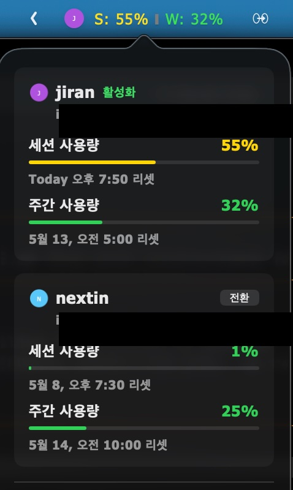

# CCMeter

> 메뉴바에서 Claude Code 계정을 전환하고, 5h · 7d 사용량을 항상 본다.

<p align="center">
  
  &nbsp;
  
</p>

## 무엇을 해결하나

Claude Code 를 여러 계정으로 쓸 때, 한도(5시간 세션 · 7일 주간)에 걸리면 `~/.claude.json` 의 `oauthAccount` 와 `~/.claude/.credentials.json` 두 파일을 손으로 갈아끼워야 합니다. 잘못 덮으면 토큰이 깨지고, 작업 중 전환하면 실행 중인 CLI 가 stale 토큰으로 401 을 받습니다.

CCMeter 는 이 교체를 메뉴바에서 한 번의 클릭으로, **atomic write · 자동 백업 · 단일 진입 lock** 과 함께 처리합니다. 동시에 모든 등록 계정의 잔량과 리셋 시각을 항상 보여주므로, 한도가 차기 전에 미리 옮길 수 있습니다.

## 설치

```sh
make app
make install
open ~/Applications/CCMeter.app
```

요구 사항: macOS 13+ · Swift 6.0+. 안정 코드 사인은 `make setup-cert` 한 번이면 됩니다.

## 시작

1. 메뉴바 라벨 클릭
2. **현재 계정 가져오기** 로 활성 Claude Code 계정 등록
3. 추가 계정은 `claude auth login` 후 다시 **현재 계정 가져오기**

## 사용

| 어디 | 무엇 |
|---|---|
| 메뉴바 라벨 `[J] S: 78% W: 32%` | 활성 계정 이니셜 + 5h · 7d 사용량 |
| popover | 등록된 모든 계정의 사용량, 1-클릭 전환 |
| 설정 창 | 표시 형식, 임계치 색상, 시스템 옵션 |

## 안전 장치

- **Atomic 교체** — `tmp + fsync + rename` 로 부분 쓰기 방지
- **단일 진입 lock** — `flock` 으로 동시 전환 차단
- **자동 백업** — timestamp 백업 5개 보관, 실패 시 자동 복원
- **충돌 방지** — Claude Code CLI 실행 중에는 전환 차단

데이터는 자체 디렉터리 `~/.ccmeter/` 에만 저장하며, 다른 도구의 데이터는 건드리지 않습니다.

---

설계 결정과 회귀 가드: [ARCHITECTURE.md](ARCHITECTURE.md) · 라이선스: 내부 도구
